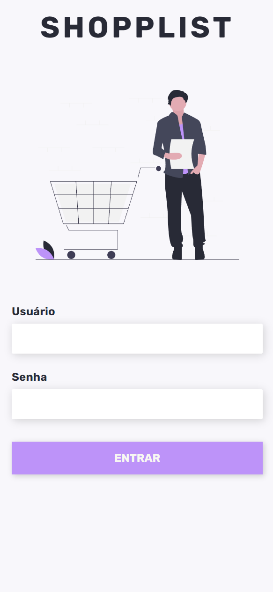

# Shopp-List
Aplicação WEB de uma lista de compras no formato TO-DO | Acesse em: [shopplist.joaobrigido.com.br](https://shopplist.joaobrigido.com.br/)

### Tecnologias utilizadas:
- Figma (UI/UX Design)
- Vite
- React
- Sass
- Supabase (Baas)

##

### Algumas imagens...

